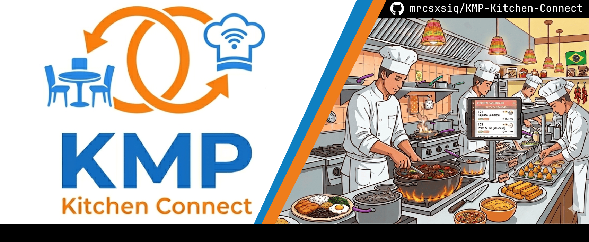

A Kotlin Multiplatform (KMP) application designed to simulate a **Kitchen Display System (KDS)** with offline-first communication between devices.

This project enables two roles:
- 🧑‍🍳 **Kitchen Mode** – receives and manages orders in a Kanban-style board
- 📱 **Order Mode** – creates and sends orders to the kitchen

---

## Features

- Kotlin Multiplatform (Desktop, Android, Tablet-ready)
- Peer-to-peer communication using Ktor + JSON
- Real-time order updates
- Kanban-style kitchen display (KDS) 

---
## Demo

In progress

---

## Architecture Overview

The system is designed to work **without internet**, using local communication between devices.

```text
[ Order Device ]  --->  [ Kitchen Display System ]
        (Client)              (Server)
```

### Key Technologies

- **Kotlin Multiplatform (KMP)**
- **Ktor** for communication
- **Kotlinx Serialization (JSON)**
- **Compose Multiplatform** (UI)
- **SQLite / Local Storage (planned/optional)**

---

## Modules

| Module       | Description                                                     |
|--------------|-----------------------------------------------------------------|
| `composeApp` | Business logic, models, networking                              |
| `androidApp` | Android application                                             |
| `jvmMain`    | Desktop application and Ktor server running inside Kitchen mode |

---

## Data Flow

1. User creates an order on **Order Mode**
2. Order is serialized to JSON
3. Sent via Ktor HTTP (or local network)
4. Kitchen receives and updates Kanban board
5. Status updates can be propagated back

---

## How to Run

### 1. Clone the repository

```bash
git clone https://github.com/mrcsxsiq/KMP-Kitchen-Connect.git
cd KMP-Kitchen-Connect
```

### 2. Run Desktop App

```bash
./gradlew :desktopApp:run
```

### 3. Run Android App

Open in Android Studio and run normally.

---

## Communication Strategy

- Uses **Ktor embedded server** in Kitchen Mode
- Order devices act as **clients**
- JSON payloads define orders and updates
- Designed for **LAN environments (same Wi-Fi)**

---

## Future Improvements

- Authentication between devices
- Persistent storage (Room / SQLDelight)
- Metrics dashboard
- Notifications

---

## Goal

This project demonstrates:
- Real-world KMP usage
- Device-to-device communication

---

## License

MIT License
